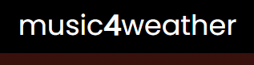

# Music4Weather


<br/>



<br/>
<br/>

> Projeto desenvolvido para o desafio fullstack Aliare.

<br/>

## Tecnologias Utilizadas

<code></code>
<code></code>
<code></code>

<br/>

## Requisitos

Antes de começar, tenha certeza de atender os seguintes requisitos:
* Node versão 14.17.6 ou maior;
* NPM ou Yarn;
* Git;
* Docker e Docker Compose.

<br/>

## Como Iniciar

Para iniciar o projeto, siga os seguintes passos:

Vá para o diretório no qual deseja clonar o proejeto e execute:
```
git clone https://github.com/alaodev/music4weather-server.git
```

Então: 
```
cd music4weather-server
```

Agora:
```
yarn ou npm i // Para instalar as dependências.
```

Para que a aplicação execute com sucesso, será necessário criar um arquivo .env na raiz do projeto. Esse arquivo é responsável por armazenar algumas chaves secretas que serão necessárias.

As 3 chaves a seguir serão de fundamental importância para o funcionamento da aplicação:

```

OPEN_WEATHER_API_KEY = <api_key>

SPOTIFY_CLIENT_ID = <api_key>
SPOTIFY_CLIENT_SECRET = <api_key>

```

Para mais informações, acesse os links:

https://openweathermap.org/api
https://developer.spotify.com/documentation/general/guides/authorization/


Após gerar todas as chaves, execute na raiz do projeto:
```
docker-compose up // adicione a flag -d caso deseje liberar o terminal após o comando.
```

Por padrão a aplicação irá iniciar na porta 3001. Você pode facilmente alterar esse comportamento acessando o arquivo /src/server.js
```js
const routes = require('./routes');

const PORT = 3001;
const HOST = '0.0.0.0';

const app = express();
```


[⬆ Voltar para o topo](#nlw_heat_node)<br>